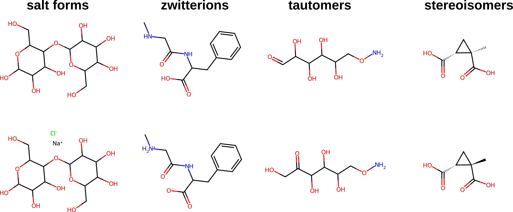

# Examples of cleaned compounds

![Examples of acids that are not primarily sour. $\mathrm{p}K_{\mathrm{a}}$ values are from literature for: saccharin[@dubois2012saccharin], aspartame[@skwierczynski1993demethylation], tannic acid[@certiat2024ph; @lin2009effect], caffeic acid[@serjeant1979ionisation], cinnamic acid[@connors1980trans], glycyrrhizic acid[@li2024ultrasonic; @ma2019biobased]; and from the IUPAC Digitized pKa Database[@iupac_pka_database; @perrin1965dissociation; @perrin1972dissociation; @serjeant1979ionisation] for glycine, L-glutamic acid, L-aspartic acid, and lauric acid. Flavors shown here are from the literature.[@da2007chemistry; @kallel2025quantification; @che2022isolation; @frattini1977volatile; @schmid2021comprehensive] \label{annotated_flavors}](./figures/annotated_flavors.png){ width=6in }

{ width=6in }

{ width=6in }

# Note on stereochemistry

Although it is noted by Zimmermann _et al._ that stereochemistry can lead to different taste perceptions, we could only identify two separate stereoisomeric compounds in FartDB that had different taste labels than their 'duplicates'. These are removed in our cleaned version of the database.

These two examples coincidentally had the same characteristics: the stereoisomer matched two other isomers, both of which are indicated without stereochemistry and one of which matches the same flavor label (whereas the other isomer flavor is 'undefined'). Owing to the match in flavor label, and the possibility for error in how 'undefined' flavors are labeled, it is probable that these matches are artifacts from the original data curation. This would mean that there are practically no stereoisomeric pairs in FartDB that have meaningfully different flavor labels.

The lack of balanced stereochemical information in the data may be one reason why the FART models were not reported to predict different flavors for stereoisomers.

# Tabulated Tukey HSD Results

Below are tabulated results corresponding to the Tukey HSD test performed in the main text.
For each dataset, the model is given in the leftmost row and each of the metrics tested in the original paper are in the columns.
Each column header states the Tukey HSD confidence half interval - models which are within this interval for the best performer are bolded, analogous to models shown as blue and grey, respectively, in the main text.

## Original

|        model            |   accuracy (q=2.54e-03) |   precision (q=1.65e-02) |   recall (q=1.28e-02) |   f1_score (q=1.22e-02) |   auroc (q=2.62e-03) |
|:------------------------|------------------------:|-------------------------:|----------------------:|------------------------:|---------------------:|
| zimmermann-augmented    |               __0.866__ |                __0.77__  |             __0.732__ |               __0.745__ |            __0.967__ |
| zimmermann              |                   0.851 |                    0.749 |                 0.696 |                   0.714 |                0.956 |
| chemprop                |               __0.864__ |                __0.784__ |                 0.698 |               __0.721__ |                0.957 |
| xgb-fingerprint-mordred |                   0.851 |                    0.738 |                 0.69  |                 0.706   |            __0.963__ |
| xgb-fingerprint         |                   0.858 |                __0.771__ |                 0.703 |               __0.724__ |            __0.962__ |
| balancedforest          |                   0.761 |                    0.563 |             __0.711__ |                   0.577 |                0.921 |

## Sanitized

|        model            |   accuracy (q=2.61e-03) |   precision (q=3.28e-02) |   recall (q=2.38e-02) |   f1_score (q=2.10e-02) |   auroc (q=3.86e-03) |
|:------------------------|------------------------:|-------------------------:|----------------------:|------------------------:|---------------------:|
| zimmermann-augmented    |               __0.897__ |                __0.74__  |                 0.676 |               __0.688__ |            __0.974__ |
| zimmermann              |                   0.889 |                    0.727 |                 0.631 |               __0.655__ |                0.964 |
| chemprop                |               __0.895__ |                    0.725 |                 0.586 |                   0.616 |            __0.968__ |
| xgb-fingerprint-mordred |               __0.9__   |                __0.798__ |                 0.639 |               __0.684__ |            __0.974__ |
| xgb-fingerprint         |               __0.899__ |                __0.759__ |                 0.603 |                   0.642 |            __0.972__ |
| balancedforest          |                   0.779 |                    0.452 |             __0.731__ |                   0.472 |                0.929 |

\newpage

# References
